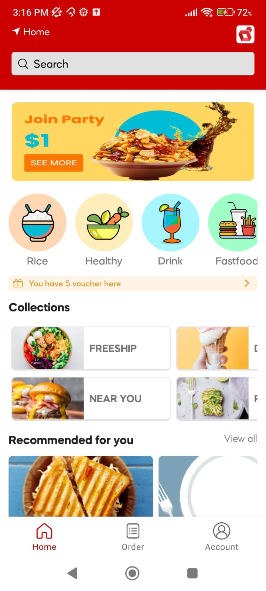

# Loginext Case Study Test

## TechStack
1. Moshi(https://github.com/square/moshi)
2. MVVM
3. Espresso , Robolectric
4. Hilt
5. Custom DI Factory Pattern
6. Pallete (https://developer.android.com/develop/ui/views/graphics/palette-colors)

### Following Assumptions Made
1. User has 1 visible screen, `home`
2. `Account` and `Order` screens are vacant
3.  Text Colors and Image background fetched from API response
4. Added app logo on appbar and updated GPS icon for simplicity and uniqueness
5. For dynamic background used `androix.pallete` in Food Category
6. Gridview for Food Collections
7. `androix.**.Flow` for `OfferCollection` for scalable width and height

## Installation
Clone this repository and import into **Android Studio**
```bash
git clone https://github.com/Dixzz/logi_quidel.git
```

## Build variants
Use the Android Studio *Build Variants* button to choose between **production** and **staging** flavors combined with debug and release build types

## Testing
1. Unit Testing
```
./gradlew.bat :app:testDebugUnitTest --tests com.loginext.quidel.ui.activities.ho
me.HomeActivityTest
```

2. Instrumented Testing
```
./gradlew.bat :app:connectedDebugAndroidTest
```

## Generating signed APK
From Android Studio:
1. ***Build*** menu
2. ***Generate Signed APK...***

## Screenshot
